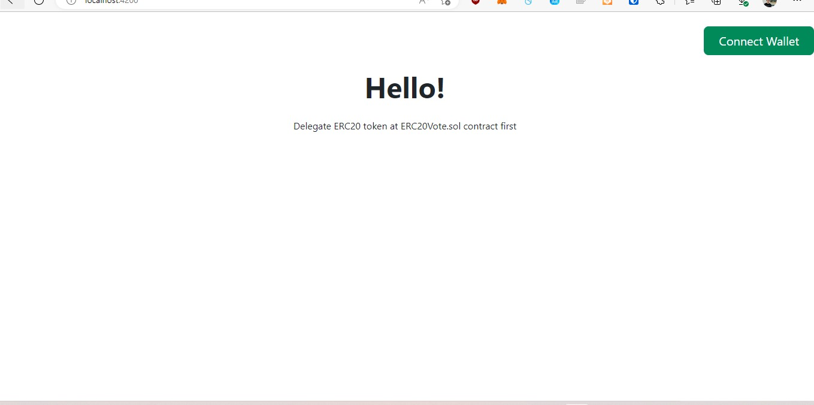
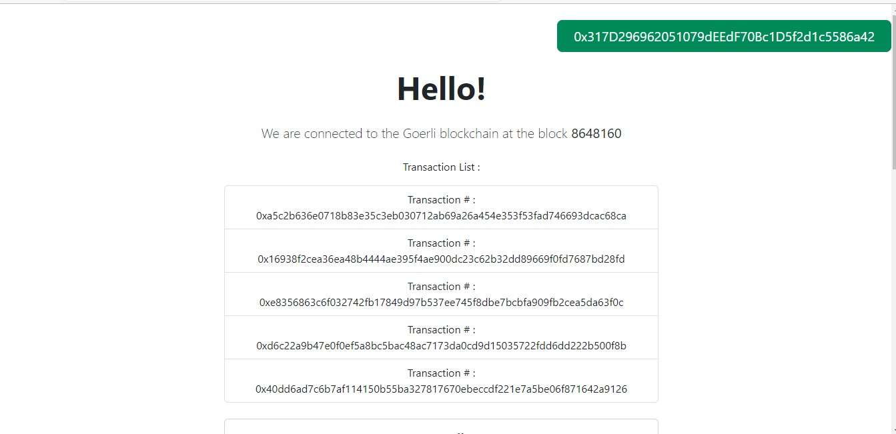
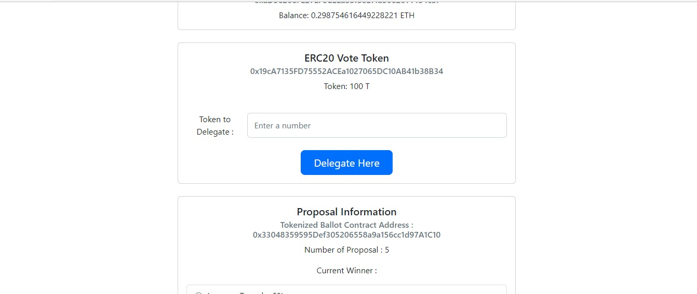
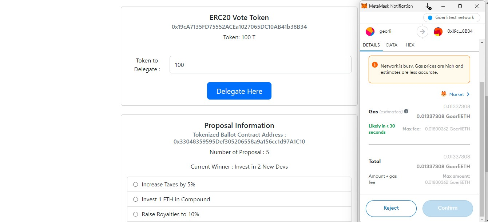
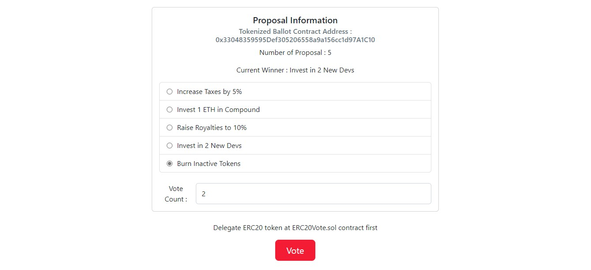
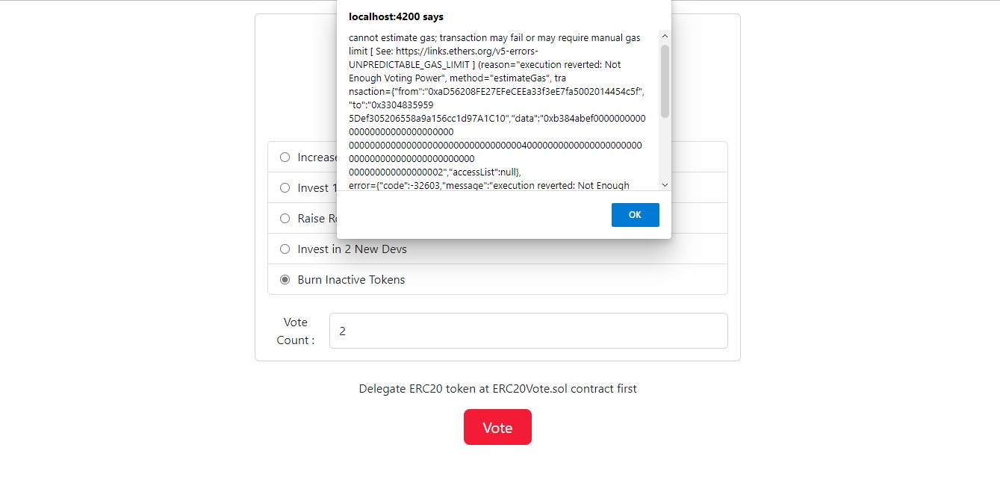

# Angular

This project was generated with [Angular CLI](https://github.com/angular/angular-cli) version 15.2.2.

## Development server

Run `ng serve` for a dev server. Navigate to `http://localhost:4200/`. The application will automatically reload if you change any of the source files.

## Screenshots

### Main Page Screenshot. User can connect wallet using metamask in the upper right corner
 

### List of transactions in the block with Goerli blockchain
 
 

### Can see user eth balance and erc20 vote token balance
 
 

### User can delegate vote tokens to this tokenzied ballot contract
 
 

### Proposal vote page where user can choose proposal and enter vote count
 
 

### When voting power is not enough , will hit this error. Metamask will return error
 
 

## Command Used

`ng serve --live-reload`

`ng build`

`npm i bootstrap`

`npm i @popperjs/core`

`npm i ethers`